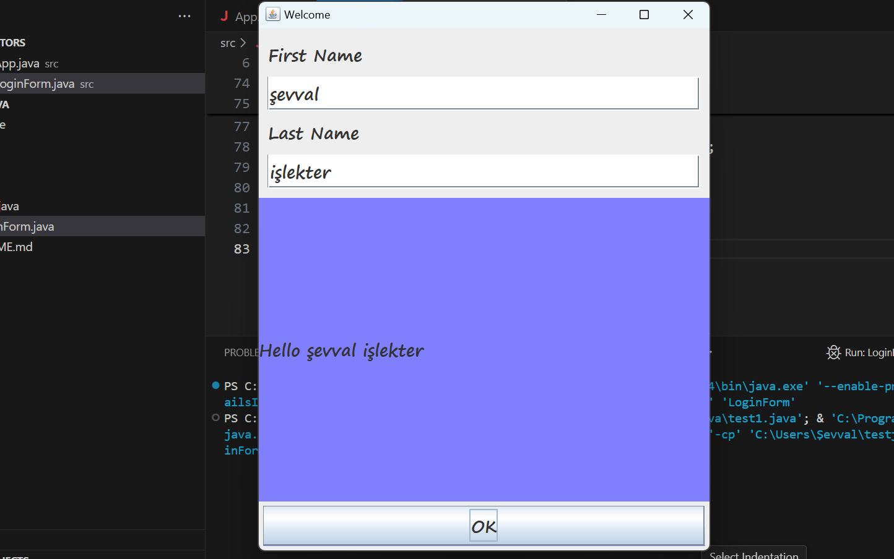

# LoginBasicJava - Java Swing Login Uygulaması

Bu proje, Java Swing kullanılarak geliştirilmiş basit bir login form uygulamasıdır.



## Özellikler

- Kullanıcı adı ve şifre giriş alanları
- Temiz ve kullanıcı dostu arayüz
- Responsive tasarım
- Basit ve anlaşılır kod yapısı

## Teknolojiler

- Java SE
- Swing GUI Toolkit
- JDK 8+

## Kurulum

1. Projeyi klonlayın:
   ```bash
   git clone https://github.com/sevvalislekter/LoginBasicJava.git
